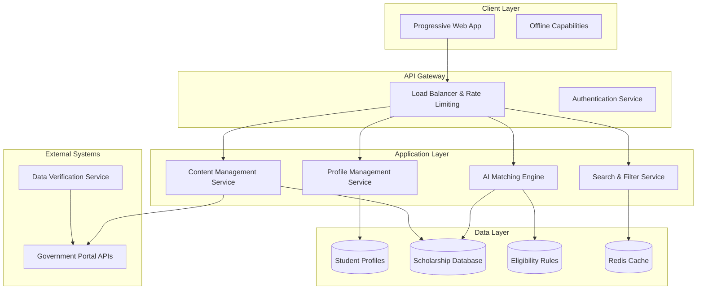

# Design Document: Adhikaar Civic Assistant

## Overview

Adhikaar is a web-based AI-powered civic information assistant that democratizes access to government scholarship information for Indian students. The system employs a rule-based expert system architecture to match student profiles with eligible scholarships, prioritizing accessibility, inclusion, and low-bandwidth optimization for users across India's diverse digital landscape.

The design emphasizes simplicity and reliability over complexity, using proven technologies to ensure the system works effectively for students with limited digital literacy and infrastructure constraints.

## Architecture

### High-Level Architecture



### Technology Stack

**Frontend:**
- Progressive Web App (PWA) with offline capabilities
- Vanilla JavaScript or lightweight framework (React/Vue.js)
- CSS Grid/Flexbox for responsive design
- Service Workers for caching and offline functionality

**Backend:**
- Node.js with Express.js or Python with FastAPI
- Rule-based expert system using production rules
- RESTful API design with GraphQL for complex queries
- JWT-based authentication

**Database:**
- PostgreSQL for structured data (profiles, scholarships)
- Redis for caching and session management
- Full-text search with PostgreSQL or Elasticsearch

**Infrastructure:**
- Cloud deployment (AWS/Azure/GCP) with CDN
- Container orchestration (Docker + Kubernetes)
- Automated CI/CD pipeline
- Monitoring and logging (ELK stack or similar)

## Components and Interfaces

### 1. User Interface Component

**Responsibilities:**
- Render accessible, low-bandwidth optimized interface
- Handle user interactions and form validation
- Provide offline capabilities and progressive enhancement
- Support multiple input methods (touch, keyboard, voice)

**Key Features:**
- Progressive Web App with offline-first design
- Responsive layout optimized for mobile devices
- High contrast mode and adjustable font sizes
- Screen reader compatibility (ARIA labels, semantic HTML)
- Minimal JavaScript with graceful degradation

**Interface:**
```typescript
interface UIComponent {
  renderProfileForm(): ProfileForm
  displayScholarshipResults(results: ScholarshipMatch[]): void
  showApplicationGuide(scholarship: Scholarship): void
  handleOfflineMode(): void
  updateAccessibilitySettings(settings: AccessibilitySettings): void
}
```

### 2. Profile Management Service

**Responsibilities:**
- Collect and validate student profile information
- Encrypt and store sensitive personal data
- Manage profile updates and data consistency
- Handle data privacy and consent management

**Key Features:**
- Secure data encryption (AES-256)
- GDPR/privacy compliance with explicit consent
- Profile versioning for audit trails
- Data validation and sanitization

**Interface:**
```typescript
interface ProfileService {
  createProfile(profileData: StudentProfile): Promise<ProfileId>
  updateProfile(id: ProfileId, updates: Partial<StudentProfile>): Promise<void>
  getProfile(id: ProfileId): Promise<StudentProfile>
  deleteProfile(id: ProfileId): Promise<void>
  validateProfileData(data: StudentProfile): ValidationResult
}
```

### 3. AI Matching Engine

**Responsibilities:**
- Execute rule-based matching algorithms
- Process eligibility criteria against student profiles
- Rank and prioritize scholarship matches
- Handle complex eligibility logic and edge cases

**Architecture:**
The matching engine uses a rule-based expert system approach with production rules stored in a knowledge base. This provides transparency, maintainability, and explainability compared to black-box ML approaches.

**Rule Representation:**
```typescript
interface EligibilityRule {
  id: string
  scholarshipId: string
  conditions: Condition[]
  priority: number
  description: string
}

interface Condition {
  field: string // e.g., 'academicLevel', 'familyIncome', 'state'
  operator: 'equals' | 'greaterThan' | 'lessThan' | 'contains' | 'in'
  value: any
  weight: number
}
```

**Matching Algorithm:**
1. **Rule Evaluation**: For each scholarship, evaluate all eligibility conditions
2. **Scoring**: Calculate match score based on condition weights
3. **Ranking**: Sort results by score, scholarship amount, and deadlines
4. **Explanation**: Generate human-readable explanations for matches

**Interface:**
```typescript
interface MatchingEngine {
  findMatches(profile: StudentProfile): Promise<ScholarshipMatch[]>
  explainMatch(profile: StudentProfile, scholarship: Scholarship): MatchExplanation
  updateRules(rules: EligibilityRule[]): Promise<void>
  validateRules(rules: EligibilityRule[]): ValidationResult
}
```

### 4. Scholarship Database Service

**Responsibilities:**
- Store and manage scholarship information
- Handle data updates from government sources
- Maintain data integrity and versioning
- Provide search and filtering capabilities

**Data Model:**
```typescript
interface Scholarship {
  id: string
  name: string
  description: string
  provider: 'central' | 'state'
  state?: string
  amount: number
  benefits: string[]
  eligibilityRules: EligibilityRule[]
  requiredDocuments: Document[]
  applicationDeadline: Date
  applicationUrl: string
  lastUpdated: Date
  isActive: boolean
}

interface Document {
  name: string
  description: string
  format: string[]
  maxSize: string
  isMandatory: boolean
}
```

### 5. Content Management Service

**Responsibilities:**
- Manage scholarship content and metadata
- Handle content updates and versioning
- Provide content in multiple formats and languages
- Ensure content accuracy and freshness

**Interface:**
```typescript
interface ContentService {
  getScholarship(id: string): Promise<Scholarship>
  searchScholarships(query: SearchQuery): Promise<Scholarship[]>
  updateScholarship(id: string, updates: Partial<Scholarship>): Promise<void>
  validateContent(scholarship: Scholarship): ValidationResult
  getApplicationGuide(scholarshipId: string): Promise<ApplicationGuide>
}
```

## Data Models

### Student Profile Model

```typescript
interface StudentProfile {
  id: string
  academicLevel: 'class10' | 'class12' | 'undergraduate' | 'postgraduate'
  currentGrade?: string
  familyIncomeRange: 'below1lakh' | '1-2lakh' | '2-5lakh' | '5-8lakh' | 'above8lakh'
  category: 'general' | 'obc' | 'sc' | 'st' | 'ews'
  gender: 'male' | 'female' | 'other'
  state: string
  district?: string
  hasDisability: boolean
  disabilityType?: string
  createdAt: Date
  updatedAt: Date
  consentGiven: boolean
  privacySettings: PrivacySettings
}

interface PrivacySettings {
  allowDataProcessing: boolean
  allowCommunication: boolean
  dataRetentionPeriod: number
}
```

### Scholarship Match Model

```typescript
interface ScholarshipMatch {
  scholarship: Scholarship
  matchScore: number
  eligibilityStatus: 'eligible' | 'partially_eligible' | 'not_eligible'
  matchedCriteria: string[]
  missingCriteria: string[]
  explanation: string
  confidence: number
  applicationDeadline: Date
  estimatedBenefit: number
}
```

### Application Guide Model

```typescript
interface ApplicationGuide {
  scholarshipId: string
  steps: ApplicationStep[]
  estimatedTime: string
  tips: string[]
  commonMistakes: string[]
  helpResources: HelpResource[]
}

interface ApplicationStep {
  stepNumber: number
  title: string
  description: string
  requiredDocuments: string[]
  externalLinks: ExternalLink[]
  estimatedTime: string
}
```

## Correctness Properties

*A property is a characteristic or behavior that should hold true across all valid executions of a system—essentially, a formal statement about what the system should do. Properties serve as the bridge between human-readable specifications and machine-verifiable correctness guarantees.*

Before defining the correctness properties, I need to analyze the acceptance criteria from the requirements to determine which ones are testable as properties.

### Property 1: Profile Validation Completeness
*For any* student profile submission, if the profile contains invalid data formats or missing required fields, the system should reject the submission and provide specific validation messages highlighting all issues.
**Validates: Requirements 1.2, 1.4**

### Property 2: Profile Update Consistency
*For any* student profile update, the system should persist all changes and refresh scholarship recommendations to reflect the updated profile information.
**Validates: Requirements 1.3**

### Property 3: Matching Engine Completeness
*For any* complete student profile, the AI matching engine should analyze the profile against all active scholarships in the database and determine qualification status for each.
**Validates: Requirements 2.1, 2.2**

### Property 4: Scholarship Ranking Consistency
*For any* set of matching scholarships for a student profile, the results should be ranked consistently by relevance score and scholarship amount in descending order.
**Validates: Requirements 2.3**

### Property 5: Performance Response Time
*For any* matching request, the system should complete processing and return results within 5 seconds under normal load conditions.
**Validates: Requirements 2.5**

### Property 6: Complete Information Display
*For any* scholarship result or detail view, the system should display all required information including scheme name, explanation, eligibility criteria, qualification reasoning, amount, benefits, and deadlines.
**Validates: Requirements 3.1, 3.2, 3.3**

### Property 7: Outdated Information Warning
*For any* scholarship information that has not been updated within the configured freshness threshold, the system should display a warning message and the last update timestamp.
**Validates: Requirements 3.5**

### Property 8: Application Guidance Completeness
*For any* selected scholarship, the system should provide complete document checklists with descriptions, step-by-step application guides with official links, format requirements, and time estimates.
**Validates: Requirements 4.1, 4.2, 4.3, 4.4**

### Property 9: Deadline Urgency Display
*For any* scholarship with an approaching deadline (within configured threshold), the system should highlight the urgency in the user interface.
**Validates: Requirements 4.5**

### Property 10: Accessibility Feature Availability
*For any* user accessing the system, accessibility features including screen reader support, keyboard navigation, high contrast mode, and adjustable font sizes should be available and functional.
**Validates: Requirements 5.2, 5.3**

### Property 11: Data Usage Optimization
*For any* page load or data transfer, the system should minimize bandwidth usage through image optimization, efficient loading patterns, and data compression.
**Validates: Requirements 5.1, 5.5**

### Property 12: Data Protection Compliance
*For any* student profile data, the system should encrypt data in transit and at rest, require explicit consent for processing, and implement additional protections for sensitive categories.
**Validates: Requirements 6.1, 6.2, 6.4**

### Property 13: Data Deletion Completeness
*For any* student profile deletion request, the system should remove all associated data including profile information, preferences, and audit logs while maintaining anonymized analytics data.
**Validates: Requirements 6.3**

### Property 14: Third-Party Data Sharing Restriction
*For any* student data, the system should not share information with third parties without explicit user consent, and should maintain logs of all data sharing activities.
**Validates: Requirements 6.5**

### Property 15: Database Update Propagation
*For any* scholarship information change, the system should update the database, refresh affected matching results, and notify users whose recommendations have changed.
**Validates: Requirements 7.2, 7.4**

### Property 16: Data Integrity Validation
*For any* scholarship data entry or update, the system should validate data integrity, check for inconsistencies against official sources, and flag discrepancies for review.
**Validates: Requirements 7.3, 9.1, 9.2**

### Property 17: Audit Trail Completeness
*For any* database change or user action, the system should create comprehensive audit logs including timestamp, user identity, action type, and data changes.
**Validates: Requirements 7.5, 9.5**

### Property 18: System Performance Under Load
*For any* increase in system load, the system should scale automatically to maintain response times under 3 seconds and handle concurrent users without performance degradation.
**Validates: Requirements 8.2, 8.3**

### Property 19: Error Handling and Recovery
*For any* system error or exception, the system should provide user-friendly error messages, suggest recovery options, and log detailed error information for debugging.
**Validates: Requirements 8.4**

### Property 20: Information Source Attribution
*For any* displayed scholarship information, the system should include source attribution, last verification date, and provide mechanisms for users to report inaccuracies.
**Validates: Requirements 9.3, 9.4**

### Property 21: Contextual Help Availability
*For any* user interface element or workflow, the system should provide contextual help, tooltips, or explanations to assist users with limited digital literacy.
**Validates: Requirements 10.1**

### Property 22: Support Request Tracking
*For any* user support request or feedback submission, the system should track the request, provide acknowledgment, and maintain analytics to identify common usability issues.
**Validates: Requirements 10.5**

## Error Handling

### Error Categories and Responses

**1. Input Validation Errors**
- Invalid profile data formats
- Missing required fields
- Out-of-range values
- Response: Clear validation messages with specific field guidance

**2. System Integration Errors**
- Government API failures
- Database connectivity issues
- External service timeouts
- Response: Graceful degradation with cached data and user notification

**3. Performance and Capacity Errors**
- High load conditions
- Memory or storage limitations
- Network connectivity issues
- Response: Automatic scaling, request queuing, and user feedback

**4. Data Consistency Errors**
- Scholarship information conflicts
- Profile update failures
- Cache synchronization issues
- Response: Data validation, conflict resolution, and manual review triggers

**5. Security and Privacy Errors**
- Authentication failures
- Unauthorized access attempts
- Data encryption issues
- Response: Security logging, access blocking, and privacy protection measures

### Error Recovery Strategies

**Automatic Recovery:**
- Retry mechanisms for transient failures
- Fallback to cached data when external services fail
- Automatic scaling for performance issues
- Data synchronization repair processes

**User-Assisted Recovery:**
- Clear error messages with suggested actions
- Alternative workflow options
- Contact information for support
- Progress saving to prevent data loss

**Administrative Recovery:**
- Manual review processes for data conflicts
- System monitoring and alerting
- Backup and restore procedures
- Security incident response protocols

## Testing Strategy

### Dual Testing Approach

The testing strategy employs both unit testing and property-based testing to ensure comprehensive coverage:

**Unit Tests:**
- Focus on specific examples, edge cases, and error conditions
- Test integration points between components
- Verify specific user workflows and scenarios
- Test accessibility features and compliance
- Validate security implementations

**Property-Based Tests:**
- Verify universal properties across all inputs using randomized data
- Test system behavior with generated student profiles and scholarship data
- Validate rule-based matching logic with diverse input combinations
- Ensure data consistency and integrity across operations
- Test performance characteristics under varied load conditions

### Property-Based Testing Configuration

**Testing Framework:** 
- JavaScript: fast-check or JSVerify
- Python: Hypothesis
- Minimum 100 iterations per property test

**Test Tagging:**
Each property-based test must include a comment referencing the design document property:
```javascript
// Feature: adhikaar-civic-assistant, Property 1: Profile Validation Completeness
```

**Key Testing Areas:**

1. **Rule-Based Matching Logic**
   - Generate random student profiles and scholarship databases
   - Verify matching accuracy and consistency
   - Test edge cases in eligibility criteria

2. **Data Validation and Integrity**
   - Generate various invalid input combinations
   - Test data consistency across updates
   - Verify audit trail completeness

3. **Performance and Scalability**
   - Test response times under various load conditions
   - Verify system behavior with large datasets
   - Test concurrent user scenarios

4. **Security and Privacy**
   - Test data encryption and protection mechanisms
   - Verify consent and privacy compliance
   - Test access control and authorization

5. **Accessibility and Usability**
   - Test interface behavior across different accessibility settings
   - Verify low-bandwidth optimization
   - Test multi-language and localization features

### Integration Testing

**Government API Integration:**
- Mock government portal responses
- Test data synchronization and updates
- Verify error handling for external service failures

**Database Integration:**
- Test data persistence and retrieval
- Verify transaction integrity
- Test backup and recovery procedures

**User Interface Integration:**
- Test end-to-end user workflows
- Verify responsive design across devices
- Test offline functionality and progressive web app features

### Performance Testing

**Load Testing:**
- Simulate peak usage scenarios (scholarship application seasons)
- Test system scaling and auto-scaling capabilities
- Verify response time requirements under load

**Bandwidth Testing:**
- Test application performance on 2G/3G networks
- Verify data usage optimization
- Test offline functionality and synchronization

**Accessibility Testing:**
- Test screen reader compatibility
- Verify keyboard navigation functionality
- Test high contrast and font scaling features

### Security Testing

**Data Protection Testing:**
- Verify encryption implementation
- Test data anonymization and deletion
- Validate privacy compliance measures

**Authentication and Authorization:**
- Test user authentication flows
- Verify access control mechanisms
- Test session management and security

**Vulnerability Testing:**
- Conduct security audits and penetration testing
- Test input sanitization and validation
- Verify protection against common web vulnerabilities

This comprehensive testing strategy ensures that Adhikaar meets its goals of providing reliable, accessible, and secure scholarship information to Indian students while maintaining high performance and usability standards.